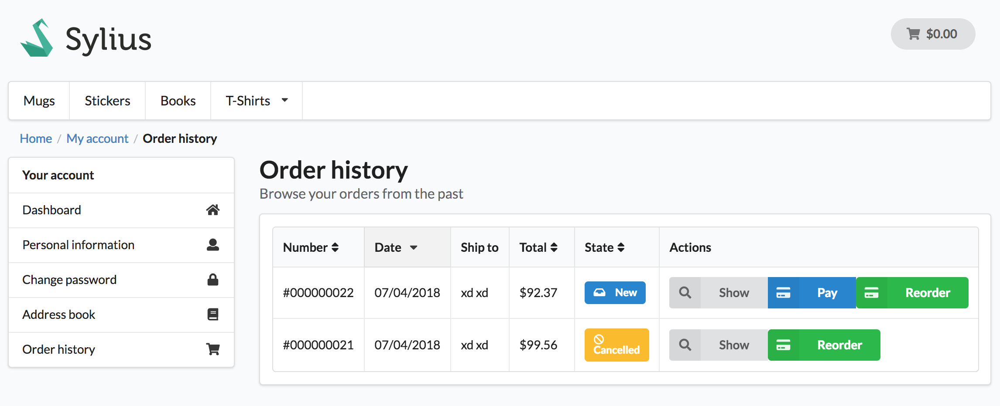

<p align="center">
    <a href="https://sylius.com" target="_blank">
        
    </a>
</p>

<h1 align="center">Customer Reorder Plugin</h1>

<p align="center">This plugin allows customers to reorder a previously placed order.</p>



## Installation

1. Require plugin with composer:

    ```bash
    composer require sylius/customer-reorder-plugin
    ```

2. Import configuration:

    ```yaml
    imports:
        - { resource: "@SyliusCustomerReorderPlugin/Resources/config/config.yml" }
    ```

3. Import routing:

    ```yaml
    sylius_customer_reorder:
        resource: "@SyliusCustomerReorderPlugin/Resources/config/app/reorder_routing.yml"
    ```

4. Add plugin class to your `AppKernel`:

    ```php
    $bundles = [
        new \Sylius\CustomerReorderPlugin\SyliusCustomerReorderPlugin(),
    ];
    ```

5. Clear cache:

    ```bash
    bin/console cache:clear
    ```

## Extension points

Customer Reorder plugin is based on two processes:

* reorder processing
* reorder eligibility checking

They are both based on Symfony's compiler passes and configured in `services.xml` file.

ReorderProcessing and EligibilityChecking are independent processes - once a Reorder
is created using Processors (services tagged as `sylius_customer_reorder_plugin.reorder_processor`), the created
entity is passed to Eligibility Checkers (services tagged as `sylius_customer_reorder_plugin.eligibility_checker`).

Hence, both processes can be extended separately by adding services that implement `ReorderEligibilityChecker`
and are tagged as `sylius_customer_reorder_plugin.eligibility_checker` or implement `ReorderProcessor` and are tagged as
`sylius_customer_reorder_plugin.reorder_processor`.

Both `Reorder` button layout and action performed on clicking it are defined in
`reorder.html.twig` template which is declared in `config.yml` file.

What's more, since Order is a Resource, major part of its configuration is placed
in `*.yml` files. Without using the plugin, Order had `Show` and `Pay` actions.
Adding `Reorder` action required extending order-related behaviours in `config.yml` file.

You can read much more about Resources here:
<http://docs.sylius.com/en/1.2/components_and_bundles/bundles/SyliusResourceBundle/index.html> 
